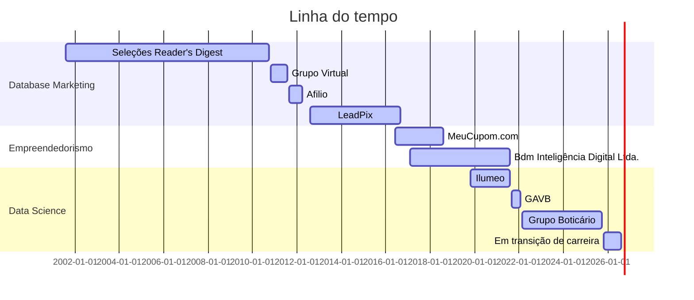

## 👋 Olá, eu sou o Raufe

Data Scientist em recomeço — voltando à área depois de um tempo fora, remontando meu portfólio com projetos práticos de ponta a ponta.

- 🔭 Atualmente trabalhando em um projeto de **análise e controle de orçamento pessoal** com Python, usando a **API do Gemini** para classificar categorias de gastos e gerar insights financeiros
- 🌱 Aprofundando conhecimentos em **Python, pandas, scikit-learn e IA generativa (LLMs)** aplicados a problemas reais
- 🎯 Objetivo: construir um portfólio sólido de Data Science, do problema aos resultados
- 📫 Contato: [LinkedIn](https://www.linkedin.com/in/rauferibeiro/) · [raufe.ribeiro@gmail.com](mailto:raufe.ribeiro@gmail.com)

### 🧭 Trajetória

### 🛠️ Stack

### 📌 Projetos em destaque

- **[Controle de Orçamento Pessoal](https://github.com/raufe/NOME-DO-REPO)** — Análise de gastos pessoais com Python e pandas, com a API do Gemini classificando categorias automaticamente e gerando insights financeiros. *(torne o repositório público antes de linkar aqui)*

## 💼 Atuação profissional

📊 Cientista de Dados — Em transição de carreira (11.2025 - atual)

🍬 Cientista de Dados Especialista - Grupo Boticário (03.2022 - 10.2025)

📈 Cientista de Dados Especialista - GAVB (09.2021 - 02.2022)

📉 Data Scientist, Consultor associado - Ilumeo (11.2019 - 08.2021)

🚀 Founder and Head of Tech - Bdm Inteligência Digital Ltda. (02.2017 - 08.2021)

📧 Consultor de Email Marketing e CRM - MeuCupom.com (06.2016 - 08.2018)

📧 Gerente de DBM e Marketing Digital - LeadPix (08.2012 - 09.2016)

📧 Gerente de Email Marketing e DBM - Afilio (09.2011 - 04.2012)

📧 Gerente de Database Marketing - Grupo Virtual (11.2010 - 08.2011)

📊 Coordenador de Database Marketing - Seleções Reader's Digest (05.2009 - 10.2010)

📊 Analista de Database Marketing - Seleções Reader's Digest (08.2001 - 04.2009)

### 📊 Atividade

